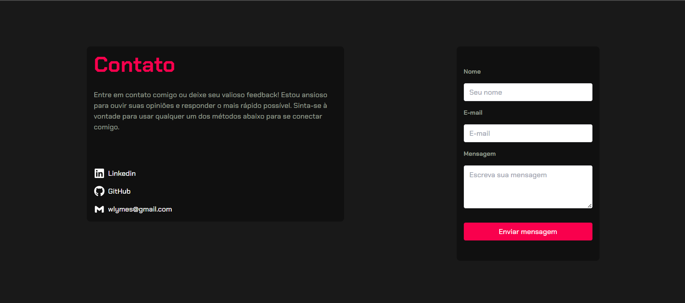

</h1>
   
<h1>WillCode - Contato</h1> 

## Descrição

### Bem vindo a minha página de contato personalizada! Através do poderoso [Nodemailer](https://nodemailer.com/about/), posso receber mensagens dos visitantes diretamente no meu email, de forma prática e instantânea, sem precisar que eles recarreguem a página. O design é simples, intuitivo e atraente, tornando o processo de conexão comigo mais fácil do que nunca. Fale comigo, deixe sua mensagem e estabeleça um canal direto, usando a minha página de contato personalizada. Estou ansioso para ouvir o que você tem a dizer.

[Ver Projeto](https://willcode-contact.vercel.app/)

#

## Layout web

 

## 🛠️ Tecnologias

💻 **Front-end**
- [Next.js 13.4](https://nextjs.org)
- [Typescript](https://www.typescriptlang.org)

📚 **Bibliotecas**
- [nodemailer](https://nodemailer.com/about/)
- [zod](https://zod.dev/)
- [next-pwa](https://www.npmjs.com/package/next-pwa)
- [react-hook-form](https://react-hook-form.com/)
- [react-toastify](https://www.npmjs.com/package/react-toastify)
- [react-icons](https://react-icons.github.io/react-icons/)

🎨 **Estilização**
- [tailwindcss](https://tailwindcss.com/docs/installation)

🔋 **Versionamento e Deploy**
- [Git](https://git-scm.com)
- [Vercel](https://vercel.com/)

 

⚙️ **Configuranções e Instalações**

Clone do Projeto

    $ git clone https://github.com/renovatt/willcode-contact.git
Instalando as dependências

    $ npm install

Iniciando o projeto

    $ npm run dev

 

**Como contribuir?**

- Você pode dar suporte me seguindo aqui no GitHub
- Dando uma estrela no projeto
- Criar uma conexão comigo no linkedin fazendo parte da minha networking e curtir o meu projeto.

 

**Autor**
[Wildemberg Renovato de Lima](https://www.linkedin.com/in/renovatt/)